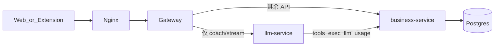

# 业务流与服务边界

## 原则

1. **业务入口走 Java**：Client → Nginx → Gateway → **business-service**。
2. **llm-service 只做对话**：`POST /api/coach/stream`（LangGraph SSE）+ 本地 sandbox；不写业务库。
3. 客户端 / 扩展只配 Gateway，不直连 Python。



## API 归属

| 能力 | 路径 | 归属 |
|------|------|------|
| 健康 / 提交 | `/health`、`/submit` | Java |
| 鉴权 / 用户 | `/api/auth/**`、`/api/users/**` | Java |
| 题目 / 统计 / 掌握 | `/api/problems/**`、`/api/stats/**`、`/api/mastered` | Java |
| 学习 / 题单 / 复习 | `/api/learning/**`、`/api/lists/**`、`/api/review/**` | Java |
| 运维 | `/api/ops/**` | Java |
| Nex 编排 | `/api/coach/prepare|session|sessions|hint` | Java |
| Nex 对话 SSE | `/api/coach/stream` | Python |
| 内网工具 / 用量 | `/internal/tools/**`、`/internal/llm/**`、`/internal/users/**` | Java（不进公网） |

## Nex 时序

```text
1. POST /api/coach/prepare     → Java 建/取 session（可 force_new；返回 turns 供 UI 回放）
2. GET  /api/coach/sessions    → 最近会话列表；GET /api/coach/session?session_id= 打开并 hydrate turns
3. POST /api/coach/stream      → Python 跑图，SSE 推送（单回合一条连接）
4. 工具回调 /internal/tools/exec → Java CoachTool
5. 图内 persist 写 L2 turns；掌握/提交等业务写仍走 Java API
```

跨轮靠 `session_id` + Checkpoint / `coach_turns`，**不是**一条 SSE 挂多轮。

## business-service 域包

| 包 | HTTP | 说明 |
|----|------|------|
| `user` | `/api/users/**`、`/api/auth/**`、`/internal/users/**` | 账号与 JWT |
| `problem` / `submission` | `/api/problems/**`、`/api/stats/**`、`/submit` | 题与提交 |
| `learning.*` | learning / lists / mastered / review | 偏好、题单、计划、SRS |
| `coach` | `/api/coach/**`、`/internal/tools/**` | 会话与工具 |
| `ops` | `/api/ops/**` | 运维台 |
| `shared` | `/health`、缓存等 | 横切 |

工具清单：[COACH_TOOLS.md](./COACH_TOOLS.md)。图与记忆：[COACH_LANGGRAPH.md](./COACH_LANGGRAPH.md)。
