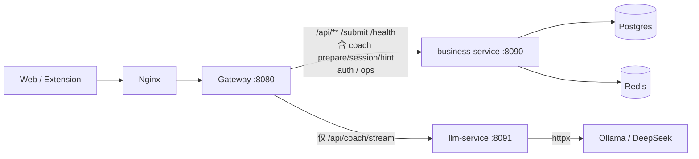

# 整体业务流与服务边界

## 原则

1. **所有业务入口走 Java**：客户端 → Nginx → **Gateway** → **business-service**（用户、题目、提交、学习、组队、支付、运维、陪练会话编排）。
2. **Python（llm-service）只负责对话过程**：LangGraph / LangChain **流式推理**（SSE），不承载业务写库与账号逻辑。
3. 服务间：业务需要模型能力时，由 **Gateway 按路径转发** 或日后由 business **显式 HTTP 调用** llm；禁止前端直连 Python 生产路径。



扩展**只配置 `API_BASE`（Gateway）**，不直连 Python；详见 [EXTENSION.md](../EXTENSION.md)。

## API 归属

| 能力 | 路径 | 归属 |
|------|------|------|
| 健康检查 | `/health` | Java（含 `coach_available`） |
| 提交采集 | `/submit` | Java |
| 鉴权 | `/api/auth/**` | Java（设备 / 账号 token） |
| 用户 | `/api/users/**` | Java |
| 题目 / 统计 / 掌握 | `/api/problems/**`、`/api/stats/**`、`/api/mastered` | Java |
| 学习 / 题单 / 复习 | `/api/learning/**`、`/api/lists/**`、`/api/review/**` | Java |
| 运维（配置/图谱/统计重建） | `/api/ops/**`（含 llm 配置入口） | Java |
| 陪练：会话 / 开场 / 提示 | `/api/coach/session`、`/prepare`、`/hint` | **Java**（读业务库、组上下文） |
| 陪练：多轮对话 SSE | `/api/coach/stream` | **Python**（LangGraph） |
| llm 进程探活 | llm 内部 `/health` | Python（仅运维刮取，不对外业务） |

## 陪练时序（目标）

```text
1. Client → Gateway → Java  POST /api/coach/prepare
     Java：建/取 session，写 opening（模板），组装上下文（题面、提交摘要…）
2. Client → Gateway → Python POST /api/coach/stream
     body: session_id + message/action +（可选）context 摘要或由 Python 再调 Java 拉上下文
3. Python：LangGraph 推理，SSE token/status/done
4. 业务落库（掌握标记、提交）始终走 Java，不经 Python
```

当前阶段：Java 侧 prepare/session/hint 可为桩；stream 在 Python 为 mock/后续接 LangGraph。  
**禁止**再增加「Python 写 users/submissions」类接口。

## 编排器-执行器（工具回调）

LangGraph 工具**不直连库**：Python 决策 → `POST /internal/tools/exec` → Java `CoachTool` 策略执行。  
工具清单与接口见 [COACH_TOOLS.md](./COACH_TOOLS.md)。  
会话/长期记忆见 [COACH_MEMORY.md](./COACH_MEMORY.md)。

- 这不是微服务爆炸：仍是 Gateway + 业务单体 + **专项对话进程**。
- Python 单独进程的原因：LangGraph/Python 生态与长连接 SSE，而非拆业务域。

## 变更记录

- 去掉对外依赖 Nginx `/llm/` 直连（避免绕过 Java/Gateway）。
- Gateway：仅 `/api/coach/stream` → llm-service；其余 `/api/coach/**`、`/api/ops/llm/**` → business-service。
