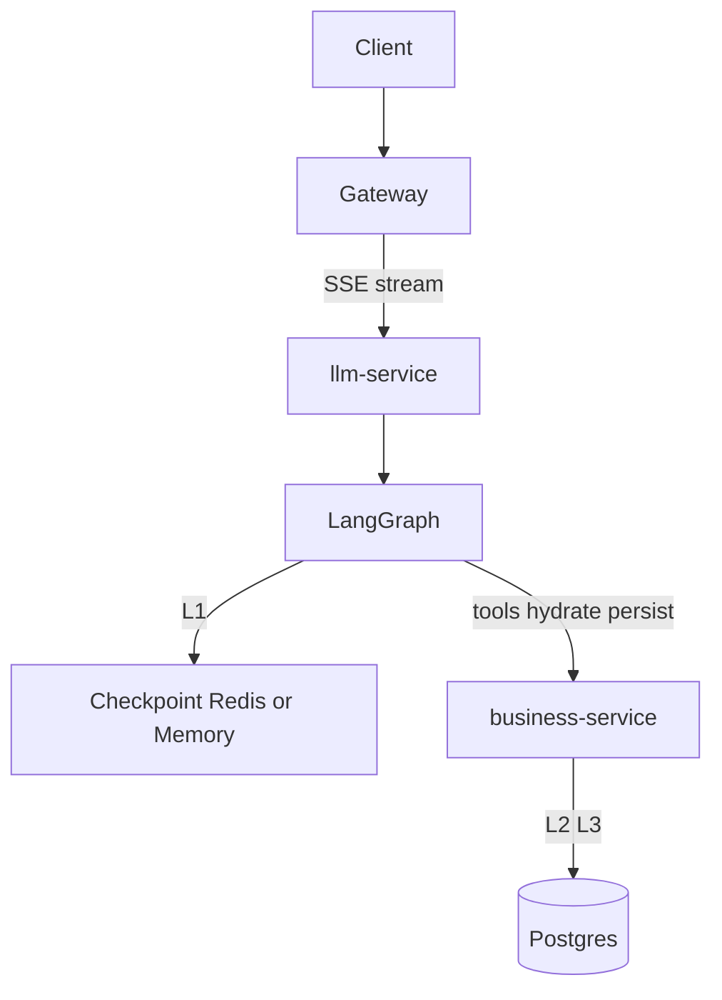

# 陪练 LangGraph 架构特性（当前定义）

本文描述 **CodeArena `llm-service` 当前已实现** 的图、State、Checkpoint 与流转，而非规划草案。  
相关：记忆三层见 [COACH_MEMORY.md](./COACH_MEMORY.md)；工具边界见 [COACH_TOOLS.md](./COACH_TOOLS.md)；  
面试备考计划场景的扩充计划见 [COACH_PLAN_AGENT.md](./COACH_PLAN_AGENT.md)（意图 / 图 / 工具，尚未全部落地）。

---

## 1. 总览

| 特性 | 当前定义 |
|------|----------|
| 入口 | `POST /api/coach/stream`（Gateway → llm-service） |
| 图文件 | [`apps/llm-service/app/coach/graph.py`](../../apps/llm-service/app/coach/graph.py) |
| 编排原则 | AI/图定策略；Python 传令；Java 执行（工具回调 `/internal/tools/exec`） |
| 单回合驱动 | `stream.py`：`graph.stream(..., stream_mode=["custom","updates"])` |
| 身份 | 请求头 `X-User-Public-Id` → state / 工具透传 |
| L2 落库 | **图内 `persist` 节点**（每回合 END 前）；禁止 SSE `done` 后再图外写库 |



---

## 2. 图拓扑与节点定义

```text
START → hydrate → classify → refuse | offer | confirm | agent ⇄ tools → finalize → persist → END
```

| 节点 | 是否调 LLM | 定义 |
|------|------------|------|
| **hydrate** | 否 | 调 `get_session_context` 对齐 topic/kind/problem/phase/summary；若本回合几乎无历史则从 `coach_turns` 回填 messages；拉画像/`memory_digest`；预取 `offer_payload`。**无有效 L2 phase 时回退 `lobby`**，禁止凭空升为 `in_problem` |
| **classify** | 否 | 规则意图 + 置信度 + 注入软信号 → `intent` / `route` / `close_scope`；低置信或注入 → **`confirm`** |
| **refuse** | 否 | 离题：边界话术 + CTA |
| **offer** | 否 | 空闲/收束选题话术（高置信续刷/新荐） |
| **confirm** | 否 | 灰区：SSE `confirm` 下发可点击选项；用户点选后把固定文案当用户消息发出 |
| **agent** | 是 | `bind_tools` **stream**；无 tool_calls 时逐 token 推送；有工具调用不推正文 |
| **tools** | 否 | 执行 tool_calls → `ToolMessage`；异常时仍返回带 `error` 的 ToolMessage |
| **finalize** | **否** | **不二次调 LLM**。护栏；维护 `summary` + messages 窗口 |
| **persist** | 否（工具写） | **每回合必做**：`append_coach_turn`×2 + `sync_session_state` |

条件边：

- `classify` → `route` ∈ `{refuse, offer, confirm, agent}`
- `agent` → 有 tool_calls 且未超轮次 → `tools`，否则 → `finalize`
- `tools` → `agent`
- `refuse` / `offer` / `confirm` → `finalize` → `persist` → `END`

---

## 3. State（`SmartState`）

定义见 [`state.py`](../../apps/llm-service/app/coach/state.py)。`messages` **整表替换**（非 append reducer），由节点自己拼完整列表。

### 3.1 Durable（跨回合，进 Checkpoint）

| 字段 | 定义 |
|------|------|
| `session_id` | 业务会话 ID（常与 prepare 一致） |
| `user_public_id` | 用户公开 ID |
| `session_kind` | `lobby` \| `problem` \| `topic` |
| `topic` | 专题名，如 `链表`；空=非专题线 |
| `problem_id` | 当前绑定题号；**唯一真相** |
| `phase` | 见下节 |
| `intent` | 见下节 |
| `turn_count` | 图内累计回合 |
| `summary` | 滚动规则摘要（非全文） |
| `refuse_short` | 连续拒答时缩短话术 |

### 3.2 Ephemeral（本回合工作区）

| 字段 | 定义 |
|------|------|
| `pending_action` | 前端 action：`close` / `diagnose` / `deep_analysis`… |
| `allow_code_原文` | 本回合是否允许有限代码原文 |
| `route` | `refuse` \| `offer` \| `confirm` \| `agent` |
| `reply` / `offer_cta` | 本回合回复 |
| `close_scope` | `none` \| `problem_segment` \| `session` |
| `confirm_choices` | confirm 节点选项（前端按钮） |
| `intent_confidence` / `injection_suspect` | classify 诊断字段 |
| `profile_digest` / `memory_digest` / `topic_digest` | hydrate 注入的小摘要 |
| `offer_payload` | 预取 CTA，供 refuse/offer |
| `pending_tool_rounds` | 本回合已跑工具轮次 |
| `force_digest` | 是否在 persist 内触发 remember |
| `tokens_emitted` | agent 已逐 token 推送时，finalize 避免整段重发 |

### 3.3 常量

| 常量 | 值 | 含义 |
|------|-----|------|
| `MESSAGE_WINDOW` | 16 | 条数上限（再叠加 token 预算） |
| token 预算 | ≈8000 | `window.trim_messages` 近似 4 字/token |
| `DIGEST_EVERY_N_TURNS` | 6 | 每 N 回合可触发 remember；**L2 落库每回合都做** |
| `MAX_TOOL_ROUNDS` | 3 | agent⇄tools 最多轮次 |

`close_scope ∈ {problem_segment, session}` 时 **强制** 走 remember 时机（与轮次无关）。

---

## 4. Phase / Intent / Route / CloseScope

### Phase（会话进展）

| phase | 含义（当前） |
|-------|----------------|
| `lobby` | 闲置/未绑题大厅 |
| `today_brief` | 进度/专题复盘 |
| `prep` | 选题准备 |
| `in_problem` | 单题跟练 |
| `wrap` | 本段收束（**默认不关 session**） |

合法迁移见 [`phases.py`](../../apps/llm-service/app/coach/phases.py) `ALLOWED_TRANSITIONS`。

### Intent（规则分类）

`practice_continue` · `practice_new` · `status_review` · `in_problem_help` · `meta_product` · `off_topic` · `want_full_answer` · `clarify`

### Route（classify 唯一出口）

| route | 含义 |
|-------|------|
| `refuse` | 离题拒答节点 |
| `offer` | 确定性选题/CTA |
| `confirm` | 灰区：请用户点选下一步（固定文案回传） |
| `agent` | 进 LLM |

路由要点：

- 置信度 < 0.75 或 `clarify` → `confirm`（绑题短句题内帮助 ≥0.7 可例外进 agent）
- 注入软信号 → `confirm`（不进 agent）
- `action=close` → `offer` + `close_scope=problem_segment`
- `off_topic` → `refuse`
- 高置信续刷/新荐 → `offer`

### CloseScope（收束粒度）

| 值 | 含义 | 落库 |
|----|------|------|
| `none` | 继续聊 | session 仍 `active`；仍写 turns + sync phase |
| `problem_segment` | 结束本轮/本题段 | phase→wrap；**不**关 session；可 remember |
| `session` | 关整条线 | `status=closed` |

前端 SSE `done.done === true` 仅当 `close_scope == session`。

---

## 5. Checkpoint（L1）怎么定

实现：[`checkpoint.py`](../../apps/llm-service/app/coach/checkpoint.py)。

| 项 | 定义 |
|----|------|
| **thread_id** | `smart:{user_public_id}:{session_id}` |
| **存什么** | 整份 `SmartState`（含窗口内 messages、phase、summary…） |
| **后端** | `CHECKPOINT_BACKEND`：`auto`（探测 `JSON.SET`）\| `redis` \| `memory`。需 **redis-stack**（本机 `make redis-stack`，默认 **:6380**；Compose 镜像 `redis/redis-stack-server`）。普通 Homebrew `redis` 可继续占 :6379，互不抢端口；`REDIS_URL` 指向 stack 端口 |
| **TTL** | 默认 7 天 |
| **过期后** | hydrate 用 `get_session_context` + turns 复活；**无合法 phase → `lobby`** |

---

## 6. 单回合流转（端到端）

```text
1. Client → prepare(Java)     可选：建/复用 session（含 topic）
2. Client → stream(Python)
     ready{session_id, graph=smart, checkpoint=redis|memory}
3. 组装 graph_input（本回合 HumanMessage + checkpoint 恢复的 durable 字段）
4. 图执行：
     hydrate → classify → … → finalize → persist
     custom：info / token（agent 上游流或 finalize 分块）
     persist：append_coach_turn + sync_session_state（图内）
5. done{reply, phase, close_scope, done}
```

专题开线：同用户同 `topic` 且 `active` → **复用** `session_id`；换专题必须 **新 prepare**。

---

## 7. 与三层记忆的对应

| 层 | 何时读/写 | 谁写 |
|----|-----------|------|
| L1 Checkpoint | 每回合 graph 自动读写 | LangGraph checkpointer |
| L2 sessions/turns | hydrate 读；**persist 每回合写** | Java tools |
| L3 memories | hydrate 经画像附带；persist/`remember` 写 | Java tools |

口诀：**短期靠图状态，中期靠会话表，长期靠用户记忆表；库只听 Java；图成功与落库同一路径。**

---

## 8. SSE 事件（当前）

| type | 主要字段 | 来源 |
|------|----------|------|
| `ready` | `session_id`, `graph`, `checkpoint`, `actions_hint` | stream 入口 |
| `info` | `phase`, `intent`, `route`, `intent_confidence`… | classify |
| `confirm` | `prompt`, `choices[{id,label,text}]` | confirm；前端渲染按钮，点击把 `text` 当用户消息发送 |
| `ask_user` | `intro`, `questions[{id,prompt,options,…}]` | LOCAL `ask_user`；前端多题卡片，提交 `action=submit_user_reply` |
| `solve_progress` | `analysis`, `steps[{id,goal,done,summary}]`, `next`, `all_done` | solve_* 工具 / finalize |
| `code_result` | `language`, `exit_code`, `timed_out`, `stdout_preview`, `stderr_preview` | `code_execution` |
| `token` | `text`（agent 上游流式；refuse/offer 分块）；护栏改写时 `replace=true` | agent / finalize |
| `done` | `reply`, `phase`, `close_scope`, `done`；等待澄清时 `awaiting=ask_user` 且 `done=false` | stream 收尾 |
| `error` | `message` | 配置失败 / 异常 |

**伪 interrupt（P0）**：`ask_user` → 写 checkpoint.`paused_ask` → SSE `ask_user` + `done.awaiting` → 下轮 `submit_user_reply` + `answers` → hydrate 注入 ToolMessage → 强制 agent。暂停中发普通消息则取消 `paused_ask` 后走 classify。

**工具门控**：`in_problem` / `in_problem_help` 才挂 `solve_*` + `code_execution`；`MAX_TOOL_ROUNDS` 题内 5、其它 3。沙箱仅在 llm-service（`app/sandbox/`）。

---

## 9. 源码索引

| 模块 | 路径 |
|------|------|
| 图 | `apps/llm-service/app/coach/graph.py` |
| State | `apps/llm-service/app/coach/state.py` |
| 路由 | `apps/llm-service/app/coach/routing.py` |
| 确认选项 | `apps/llm-service/app/coach/confirm.py` |
| LOCAL 工具 | `apps/llm-service/app/coach/local_tools.py` |
| Solve 状态机 | `apps/llm-service/app/coach/solve/` |
| Sandbox | `apps/llm-service/app/sandbox/` |
| Checkpoint | `apps/llm-service/app/coach/checkpoint.py` |
| SSE 驱动 | `apps/llm-service/app/coach/stream.py` |
| 意图/阶段 | `intent_smart.py` / `phases.py` |
| 窗口/摘要 | `window.py` |
| Java 会话 | `coach/memory/*`；Flyway V3=`coach_code_runs` + mastery 占位 |

---

## 10. Backlog（未做）

- classify 灰区用极小 `classifier_llm`（当前以 confirm 选项代替）
- hydrate 并行 `Send` 降首字延迟
- 真 LangGraph `interrupt`（P0 用伪 interrupt）
- 真·token 计数器（tiktoken）替代 4 字近似
- 沙箱 bwrap / sidecar；c/cpp 语言
- `append_code_run` Java 审计工具（表已就绪）
- mastery / spaced repetition（表已占位）
