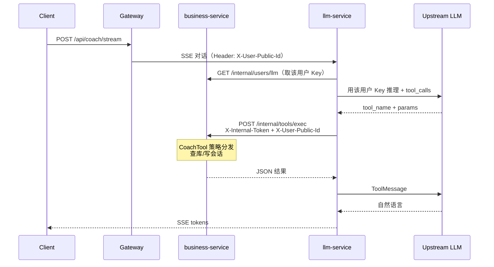

# 陪练工具与编排器-执行器模式

## 1. 当前工具清单（对齐原 LangGraph smart_agent）

| 工具名 | 类型 | 执行方 | 说明 |
|--------|------|--------|------|
| `get_session_binding` | READ | **Java** | 会话是否绑题 |
| `bind_problem` | WRITE | **Java** | 绑题 / 返回候选 |
| `get_current_code` | READ | **Java** | 当前题最新提交代码 |
| `get_error_summary` | READ | **Java** | 错因/挣扎统计 |
| `get_latest_submission` | READ | **Java** | 用户最近提交（无源码） |
| `list_unpassed_problems` | READ | **Java** | 未 AC 列表 |
| `get_user_profile_summary` | READ | **Java** | 画像摘要 |
| `get_topic_mastery` | READ | **Java** | 按标签聚合 |
| `get_problem_mastery` | READ | **Java** | 单题掌握 |
| `suggest_next_problems` | READ | **Java** | 续刷/新荐候选 |
| `generate_study_plan` | WRITE | **Java** | 按目标生成题单 ± 多日日程（company/topic/list） |
| `get_today_tasks` | READ | **Java** | 今日计划任务 |
| `get_active_plan` | READ | **Java** | 进行中计划摘要 |
| `recall_memories` | READ | **Java** | 跨会话长期记忆 |
| `remember` | WRITE | **Java** | 写入长期记忆 |
| `forget_memory` | WRITE | **Java** | 软删长期记忆 |
| `get_last_advice` | READ | **Python 本地** | 仅读本会话消息，无 DB |

内部（不进 LLM TOOL_SPECS）：`append_coach_turn`、`sync_session_state`、`get_session_context` — hydrate / stream 落轮次用。

> CodeArena 中：**禁止** LLM/Python 直连数据库；Java 持有 Repository。

## 2. 编排器-执行器（Orchestrator-Executor）



口诀：**AI 定策略，Python 传令，Java 执行，库只听 Java。谁填的 Key，就用谁的 Key。**

## 3. Java 策略接口化

```
com.codearena.business.coach
  tool/
    CoachTool / Context / Result / Registry
    impl/*Tool.java          # 每工具一文件，@Component 自动注册
  web/
    external/CoachController           # /api/coach/**
    internal/InternalToolController    # /internal/tools/**
```

新增工具：在 `tool.impl` 实现 `CoachTool` + `@Component`，**不必改 Controller**。

### 内网协议

```http
POST /internal/tools/exec
X-Internal-Token: <shared>
X-User-Public-Id: usr_xxx
Content-Type: application/json

{
  "tool_name": "suggest_next_problems",
  "params": { "limit": 3 },
  "session_id": "biz-...",
  "problem_id": 215
}
```

- **不要**把 `/internal/**` 配进公网 Gateway / Nginx（当前仅代理 `/api`、`/submit`、`/health`）。
- Token：`codearena.internal.token` / 环境变量 `CODEARENA_INTERNAL_TOKEN`。

写类长任务的 `202 + task_id` 轮询可后续加；当前 WRITE 仅 `bind_problem` 同步短路径。

## 4. Python 侧（LangGraph）

- `app/coach/`：`hydrate → classify → refuse|offer|agent⇄tools → respond → digest?`
- `app/coach/routing.py`：意图/phase/route 表
- `app/coach/state.py`：durable vs ephemeral State
- `app/services/tool_client.py`：`TOOL_SPECS` + `JavaToolClient`
- Checkpoint：`app/coach/checkpoint.py` — Redis（TTL）优先；`thread_id=smart:{user}:{session}`

## 5. 按用户 LLM Key

| 路径 | 说明 |
|------|------|
| `user_llm_settings` 表 | 按 `user_id` 存 provider / model / api_key |
| `GET/POST /api/users/me/llm/**` | 用户自己的配置 |
| `GET/POST /api/ops/llm/**` | 运维台同一套逻辑（按 `X-User-Public-Id`） |
| `GET /internal/users/llm` | llm-service 取**明文** Key（仅内网） |

公开 API 只返回 `has_api_key` + 掩码；可选 `CODEARENA_LLM_KEY_SECRET` 做 AES-GCM 落库。

## 6. 与 BUSINESS_FLOW / 记忆模块的关系

- 业务流：[BUSINESS_FLOW.md](./BUSINESS_FLOW.md) — stream 在 Python；工具与 Key 在 Java
- 记忆三层：[COACH_MEMORY.md](./COACH_MEMORY.md) — checkpoint / sessions / long-term
- 面试备考 / 专题计划工具与意图扩充：[COACH_PLAN_AGENT.md](./COACH_PLAN_AGENT.md)（`generate_study_plan` 等 **P0 已落地**）
