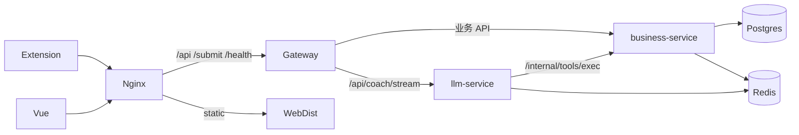

# CodeArena 设计 Rational · STAR 讲稿

> 面向面试与设计评审：用 **STAR**（Situation / Task / Action / Result）讲清  
> **每个模块为什么这么设计、整体为什么这么架构、技术为什么这么选型**。  
> 描述对齐仓库当前实现（见同目录其它架构文档），不含未落地能力的包装。

**配套索引**

| 文档 | 用途 |
|------|------|
| [OVERVIEW.md](./OVERVIEW.md) | 拓扑与原则 |
| [BUSINESS_FLOW.md](./BUSINESS_FLOW.md) | API 归属与时序 |
| [COACH_LANGGRAPH.md](./COACH_LANGGRAPH.md) | 图 / State / 记忆 |
| [COACH_TOOLS.md](./COACH_TOOLS.md) | 工具与内网协议 |
| [DATA_CACHE.md](./DATA_CACHE.md) | 表、索引、缓存 |
| [OBSERVABILITY.md](./OBSERVABILITY.md) | 观测栈 |
| [ROADMAP.md](./ROADMAP.md) | 刻意不做与下一步 |

---

## 0. 怎么用这篇文档

- **开场 2 分钟**：读 §1 + §2。  
- **深挖某一层**：跳到对应模块 STAR。  
- **被问「为什么不用 X」**：看各节 *Result* 里的「刻意不做 / 取舍」。  
- **被问评测**：见 §14（诚实缺口 + 预案）。

STAR 在本文中的约定：

| 字母 | 含义（本项目语境） |
|------|-------------------|
| **S** Situation | 当时面临的问题、约束、失败模式 |
| **T** Task | 要达成的目标与非目标 |
| **A** Action | 实际选的架构 / 模块设计 / 技术 |
| **R** Result | 得到什么、付出什么代价、已知局限 |

---

## 1. 项目总 STAR（电梯稿）

### S — Situation

要做在线刷题产品：用户在力扣做题，需要把提交沉淀成个人数据，并用 AI 陪练（**Nex**）做选题、跟练、复习，而不是「又一个 ChatGPT 壳」。  
约束：团队规模有限；必须同时有 **可靠业务写库** 与 **流式对话 / Agent 编排**；客户端含 Web 与浏览器扩展。

### T — Task

1. 业务数据（用户、提交、计划、SRS、会话）**强一致、可审计**。  
2. AI 对话 **可流式、可工具调用、可恢复会话**。  
3. 客户端 **只认一个 API 入口**，不直连多个后端。  
4. 不过早微服务化，但给 AI 进程留下独立扩缩空间。

### A — Action

采用 **Nginx → Spring Cloud Gateway →（business-service | llm-service）**：

- **Java（Spring Boot）**：全部业务写库与 Coach 工具执行。  
- **Python（FastAPI + LangGraph）**：仅 `POST /api/coach/stream`（SSE）。  
- **Postgres** 为业务真相；**Redis** 做 Checkpoint + 可选 stats 投影。  
- 口诀：**业务进 Java，对话只在 Python，客户端只连 Gateway；AI 定策略，Python 传令，Java 执行，库只听 Java。**

### R — Result

- 主轴已通：扩展提交 → 统计/题单 → LangGraph Nex → 题级 SRS。  
- 边界清晰，改模型/图不必动 Repository；改表结构不必进 Python。  
- 代价：多一次内网工具 RPC；跨语言联调成本；系统化评测尚未落地（§14）。

**一句话**：这是「带工具闭环的刷题业务系统」，AI 是编排层，不是唯一后端。

---

## 2. 整体架构为什么这么拆



### S

若把对话和业务塞进同一进程：要么 Java 硬写 Agent（生态弱），要么 Python 直连库（权限/事务/审计分散）。若一上来拆十几个微服务：交付与运维成本压垮小团队。

### T

在「能独立演进 AI」与「业务真相单一」之间取平衡；生产上客户端与公网只暴露网关层。

### A

| 决策 | 内容 |
|------|------|
| 形态 | **Gateway + 模块化单体 business + llm 专项进程**（文档明确：不要过早拆微服务） |
| 公网 | 只代理 `/api`、`/submit`、`/health`；`/internal/**` 不进 Gateway/Nginx |
| 对话路由 | 仅 `/api/coach/stream` → llm-service；prepare/session/hint 仍在 Java |
| 数据 | 业务表只在 Java Repository；Python 无 DB 凭证 |

### R

- AI 与业务 **进程级隔离**：LLM 延迟、Python 依赖、沙箱 CPU 不拖垮业务 JVM。  
- 业务域仍可在一个仓库/一个部署单元内按包划分（user / problem / learning / coach / ops）。  
- 已知下一步：多副本限流迁 Redis、沙箱加固等（见 ROADMAP），但不回退「Python 写库」。

### 若被问「为什么不 BFF / 不服务网格」

当前网关已承担路由、JWT 透传、限流、request_id；再加 BFF 或网格没有匹配的流量与组织复杂度，属于过早优化。

---

## 3. 技术选型总表（STAR 压缩版）

| 层级 | 选型 | 为什么选 | 为什么不选常见替代 |
|------|------|----------|-------------------|
| API 入口 | Spring Cloud Gateway | 与 Java 栈统一；Reactive 适合转发与 SSE 透传；过滤器链清晰 | 纯 Nginx 反代难做 JWT/业务限流；Zuul1 过时 |
| 业务 | Spring Boot 3 + JDK 21 | 事务、JPA、生态、招聘与工程成熟度匹配「写库真相」 | 全程 Node/Python 写库：长期治理与类型/事务边界更弱 |
| 对话 | FastAPI + LangGraph | Agent 图、Checkpoint、流式工具调用生态在 Python 更强 | 纯 Spring AI：当时图编排与社区资产不如 LangGraph 贴合 |
| DB | PostgreSQL | 关系模型清晰（提交/SRS/会话）；索引与事务够用 | Mongo 做提交/SRS 关联查询更别扭 |
| 缓存/Checkpoint | Redis / Redis Stack | stats 投影简单；LangGraph RedisSaver 需 RedisJSON | 普通 Redis 可做缓存但 Checkpoint 能力不足 |
| 前端 | Vue 3 + Vite | 现有 Web 栈；仪表盘/Coach SSE 足够 | 与后端选型无关，保持存量 |
| 发现 | Nacos 可选、默认关 | 本地/单机不强制 | 不过度依赖注册中心 |
| 观测 | SkyWalking + Loki + Prom + **Langfuse** | 跨服务链路 vs Agent 图内 trace 分工 | 单靠 APM 看不清 LangGraph 节点 |

---

## 4. Gateway 模块

### S

Web、扩展都会打后端；需要统一鉴权头、限流、防伪造内部身份；SSE 长请求与普通 API 混部。

### T

唯一公网 API 入口；身份在边缘解析后以可信头传给下游；对贵接口单独限流。

### A

- **JwtAuthGlobalFilter**：校验 JWT，写入 `X-User-Public-Id` 等，清理客户端伪造头。  
- **RedisRateLimitGlobalFilter**：共享固定窗口；登录注册、Nex 流、提交、导出分别限流；Key 优先用户 ID，匿名按 IP。  
- **RequestIdGlobalFilter**：贯通日志。  
- 路由：业务 → business；仅 stream → llm。

### R

- 下游服务信任网关头，避免每个服务重复鉴权细节。  
- Redis 故障时记录告警并临时 fail-open，避免缓存故障扩大为全站不可用；恢复后各实例继续共享计数。  
- **选型理由**：Gateway 过滤器比业务里手写 Filter 更适合统一边缘策略，共享 Redis 也支持水平扩容。

---

## 5. business-service（模块化单体）

### S

刷题域实体多：用户与鉴权、题目与提交、题单/计划、掌握、SRS、Coach 会话与工具、运维、用量。若按服务硬拆，事务与联表成本高。

### T

一个可部署单元内 **按域分包**；HTTP 边界清晰；内部工具与外部 API 分离。

### A

包结构（与 BUSINESS_FLOW 对齐）：

| 包 | 职责 |
|----|------|
| `user` | 账号、JWT、LLM 设置、用量 |
| `problem` / `submission` | 题与提交 |
| `learning.*` | 偏好、题单、掌握、计划、SRS |
| `coach` | 会话、turns、记忆、**CoachTool** |
| `ops` | 运维台 |
| `shared` | 健康检查、缓存、内网 Token 等横切 |

原则：**写库只在 Java**；`/internal/**` 仅给 llm-service。

### R

- 域边界在代码结构上可见，未来可按包拆服务而不改产品语义。  
- 避免「空 API / 空聚合表」双轨（V5 已删 team/pay/空 stats 等）。  
- **选型 Spring Boot**：`@Transactional`、JPA、Flyway 迁移与现有工程习惯一致。

---

## 6. llm-service（对话专项进程）

### S

Nex 需要：SSE 逐 token、多节点图、工具循环、Checkpoint、可选沙箱。这些在 Python 生态更顺；但若 Python 持有业务库，会出现第二套业务逻辑。

### T

进程 **只做对话编排**；业务读写全部回调 Java；可独立扩缩与替换模型。

### A

- FastAPI 暴露 `POST /api/coach/stream`。  
- LangGraph 图：`hydrate → classify → … → agent ⇄ tools → finalize → persist`。  
- `tool_client` → `POST /internal/tools/exec`；用户 Key → `GET /internal/users/llm`。  
- Checkpoint：`thread_id=smart:{user}:{session}`，Redis Stack 优先，失败回退 Memory。

### R

- 对话延迟与依赖升级不影响业务发布节奏。  
- **禁止** LLM/Python 直连 DB 成为铁律，面试可强调安全与治理。  
- **选型 FastAPI**：原生异步与 SSE 友好；**LangGraph**：显式状态机比「单文件 agent 循环」更可测试、可观测（接 Langfuse）。

---

## 7. 编排器–执行器（Coach Tools）

### S

若让模型「直接生成 SQL/业务结果」：不可控、不可审计。若把所有业务 if-else 写在 prompt：无法复用 Web/API 已有能力。

### T

模型只产出 **tool_calls 与策略**；执行必须走同一套业务服务；新增工具不改 Controller。

### A

```text
AI 定策略 → Python 传令 → Java CoachTool 执行 → 库只听 Java
谁填的 Key，就用谁的 Key
```

- Java：`CoachTool` + Registry + `@Component` 自动注册。  
- 协议：`tool_name` + `params` + `session_id` + 内网 Token + User-Public-Id。  
- 工具失败仍返回带 `error` 的 ToolMessage，避免流静默卡死。  
- WRITE 保持短同步路径；长任务预留 `202 + task_id` 演进位。

### R

- Web API 与 Agent 工具共享领域服务，行为一致。  
- 扩展工具 = 加一个 `impl/*Tool.java`。  
- **为什么不用「Python 内嵌业务 SDK 直连库」**：凭证面扩大、绕过 Java 校验与事务。  
- **为什么不用 MCP 公网暴露**：当前是内网一对一回调，攻击面更小。

---

## 8. LangGraph 图与三层记忆

### S

多轮陪练要：可恢复、可回放、可控 phase、控制 token 成本、防止未绑题却进入「题内解题工具」。长连接挂多轮会在断网/超时下状态难定义。

### T

单回合一条 SSE；跨轮靠 `session_id`；短期状态可丢、中期会话不可丢业务语义；长期记忆显式写入。

### A

**图设计要点**

| 点 | 设计 | 原因 |
|----|------|------|
| classify 规则路由 | 低置信/注入 → confirm；离题 → refuse | 少调 LLM、少胡操作 |
| finalize 不二次调 LLM | 护栏改写 | 控成本与延迟 |
| persist 在图内每回合必做 | append turns + sync session | 禁止 done 后再图外写导致丢轮 |
| MAX_TOOL_ROUNDS | 普通 3 / 题内 5 | 防工具死循环 |
| 工具门控 | solve/sandbox 仅 in_problem | 安全与产品语义 |
| messages 窗口 | 条数 + token 预算；Tool 成对 | 防上下文爆与脏 tool 消息 |

**记忆分层**

| 层 | 存储 | 职责 |
|----|------|------|
| L1 | Redis Checkpoint | 图短期状态；TTL 约 7 天 |
| L2 | `coach_sessions` / `coach_turns` | 回放与 hydrate 真相 |
| L3 | `user_coach_memories` | 跨会话长期记忆 |

过期/丢 Checkpoint：hydrate 用 L2 复活；无合法 phase → `lobby`（禁止凭空 `in_problem`）。

### R

- 会话与连接解耦，扩展与 Web 都能 reopen。  
- 可对 route/phase/persist 做契约测试（评测第一层，见 §14）。  
- **为什么用 LangGraph 而不是手写 while tool 循环**：节点、条件边、Checkpoint、与 Langfuse 的 span 更整齐。  
- **为什么曾暂缓、现做用户知识库 RAG**：刷题期优先结构化工具；现以「个人知识点生命周期 + Agent Tool」切入（PG 真相 + Qdrant 索引），不做通用 RAG SaaS / DeepTutor 多引擎。

---

## 9. 数据层：Postgres、索引与 SRS

### S

提交频繁、今日复习要按 due 拉题、统计要按用户聚合。若用「第二套聚合表双写」，易与明细不一致（项目已删空 `problem_stats` 双轨）。

### T

明细表为真相；查询靠索引；复习算法可解释；历史数据可懒补偿。

### A

- **真相表**：users / submissions / plans / `user_problem_srs` / coach_* / `llm_usage_events` 等。  
- **关键索引**：按 user 的时间序、Accepted 部分索引、SRS `due_at` 部分索引。  
- **SRS（SM-2 题级）**：AC 建卡/推进；非 AC AGAIN；掌握 → suspended；`/review/today` = 计划 ∪ due，去重；首次拉取 backfill≤200。

### R

- 今日队列语义清晰（计划 vs 复习分列，避免混标）。  
- 统计不走双写聚合表，改用读时计算 + 缓存投影。  
- **为什么 Postgres 而不是「提交进 ES」**：事务与 SRS 更新同路径更重要；搜索不是当前主矛盾。

---

## 10. 缓存一致性（UserStatsCache）

### S

Dashboard / 画像读多；每次从 submissions 聚合有成本。写路径多（提交、掌握、SRS），若更新缓存字段易脏。

### T

读加速；接受短暂失效；Redis 故障不能影响主路径。

### A

**Cache-Aside**：

```text
读：hit 返回 / miss 算完 put
写：成功后 invalidateUser（portrait + 该用户按日 key）
Redis 挂：静默直查 DB
```

Key：`stats:u:{id}:d:{date}`、`stats:u:{id}:portrait`；TTL 可配；local 可关 Redis。

### R

- 实现简单，与「不维护第二套 PG 聚合写路径」一致。  
- 前端进页加载 + 手动刷新，产品不要求毫秒级看板强一致。  
- **局限**：invalidate 用 `KEYS` 在用户量小时可接受，规模上来应 SCAN/精确删。  
- **为什么不 Write-Through**：聚合投影字段多、写点散，失效更稳。

---

## 11. 高并发相关设计（限流 / 连接 / 沙箱配额）

### S

真实瓶颈不是首页 QPS，而是：**SSE 占连接**、**上游 LLM 延迟**、**沙箱 CPU**、**提交突发**。

### T

按成本分级保护；贵资源按用户配额；读路径可水平扩展投影。

### A

| 手段 | 设计 |
|------|------|
| 入口限流 | stream/submit 更严的分钟桶 |
| SSE 模型 | 单回合一连接，不靠超长挂线 |
| LLM HTTP | httpx 连接池复用 |
| 沙箱 | 每用户并发 1、每分钟次数上限；超时/内存/输出截断 |
| 扩缩 | llm 与 business 进程分离，对话可先水平扩 |

### R

- 用「配额 + 限流 + 隔离」换稳定性，而不是空谈百万 QPS。  
- **诚实表述**：当前限流单机；多副本与更强沙箱隔离在 ROADMAP。  
- **为什么不先上消息队列扛提交**：提交需要同步结果与 SRS 因果，队列增加复杂度；体量未到必须异步。

---

## 12. 鉴权与用户 LLM Key

### S

扩展与 Web 双端登录；Agent 调上游模型需要 API Key；Key 不能进日志/前端明文。

### T

统一用户身份；Key 按用户存储；仅内网发给 llm-service；公开 API 掩码。

### A

- 登录发 JWT；Gateway 校验并注入用户头。  
- `user_llm_settings` 存 provider/model/key；可选 AES。  
- llm-service 调 `GET /internal/users/llm` 取 Key 再请求上游。  
- 用量写 `llm_usage_events`。

### R

- 「谁填 Key 用谁的 Key」责任清晰，便于 Ops 与用户自备 Key。  
- 内网 Token 保护 internal API；公网不暴露 `/internal/**`。  
- 详见 [USER_DOMAIN.md](./USER_DOMAIN.md)。

---

## 13. 可观测性为什么这么分层

### S

一次 Nex 回合跨越 Gateway → llm → 上游 LLM → Java 工具 → JDBC。只看应用日志无法定位是「模型慢」还是「工具慢」还是「图节点逻辑问题」。

### T

跨服务链路与 **图内推理** 分开看；日常开发不强制背负整套观测。

### A

| 层 | 技术 | 看什么 |
|----|------|--------|
| 跨服务 | SkyWalking | HTTP/JDBC 链路 |
| Agent 图 | Langfuse | node / LLM / tool |
| 指标 | Prometheus | QPS、延迟 |
| 日志 | JSON → Loki | request_id / tool_name |

观测栈 **opt-in**（`make obs-up` / `llm-obs`）。

### R

- 明确边界：SkyWalking **不会**自动画出 LangGraph 节点。  
- 避免「为了观测而默认拖垮本地开发」。  
- **为什么自托管 Langfuse**：Agent 轨迹敏感，本地可复现；与业务 APM 职责分离。

---

## 14. 评测（尚未落地）——预判与 STAR 表述

### S

面试官常问：如何知道改 prompt/图之后变好还是变差？

### T

当前阶段优先业务闭环与一致性；评测要避免无金标时上 LLM-as-judge 制造噪声。

### A（现状 + 预案，勿包装成已完成）

**现状**：无独立评测集 / 自动打分流水线。  
**已有地基**：规则路由、confirm 门控、Langfuse trace、`llm_usage_events`、可断言的 phase/route/persist。

**计划分层（口述用）**

1. **契约回归**（优先）：mock LLM/工具，断言 route、phase、工具门控、L2 persist。  
2. **线上 proxy**：路由分布、工具失败率、护栏触发、token/会话成本。  
3. **小金标 + rubric**：拒答/confirm/是否过早给题解；再考虑 judge。

### R

- 能诚实展示工程判断力：先测状态机契约，再测文采。  
- 缺口是 **harness + 金标**，不是「不知道评什么」。

**推荐答句**：

> 系统化评测还没上，是阶段性取舍。我们会先把图与工具的契约回归 CI 化，再用 Langfuse 与 usage 做线上代理指标，最后才上小规模金标。刷题陪练的核心指标是路由正确、不泄题、成本可控，而不是通用对话分数。

---

## 15. 浏览器扩展在架构中的位置

### S

力扣站内提交不会自动进自家库；用户需要在做题现场同步。

### T

扩展做薄客户端：登录 + `POST /submit` + 打开 Web/Nex；服务地址产品内置。

### A

扩展 → Gateway（与 Web 同一套鉴权）；Web 与扩展 JWT 双向对齐；未登录提交可暂存后补传。

### R

- 业务仍集中在 Gateway 后，扩展不直连 Python/DB。  
- 产品语义清楚：只登录 Web、扩展未登录 → 同步失败（可解释）。

---

## 16. 刻意不做的事（设计同样重要）

用 STAR 里的 **T（非目标）** 来讲，显得有判断力：

| 刻意不做 | 原因 |
|----------|------|
| 过早拆微服务 | 事务与交付成本；现形态已够隔离 AI |
| Python 写业务库 | 双真相、权限分散 |
| 空聚合表双写 | 易不一致；改为读投影 + invalidate |
| 默认上满观测/Nacos | 本地负担；改为 opt-in |
| DeepTutor 多引擎 RAG / 知识图谱 | 结构化工具 + 用户私有 KB 闭环优先；见 KNOWLEDGE_BASE |
| 一条 SSE 挂多轮 | 断连状态难定义 |
| finalize 再调一次 LLM | 成本与延迟 |

---

## 17. 模块 ↔ STAR 速查（面试翻页）

| 模块 | 核心 Action | 核心 Result |
|------|-------------|-------------|
| 总架构 | Gateway + Java 单体 + Python 对话 | 写库单一、AI 可扩缩 |
| Gateway | JWT、分级限流、唯入口 | 边缘策略集中；限流待 Redis 化 |
| business | 域包 + 事务写库 | 可演进的模块化单体 |
| llm | LangGraph SSE only | 对话与业务进程隔离 |
| Tools | 编排器–执行器 | 策略与执行分离、可审计 |
| Memory | L1/L2/L3 + 图内 persist | 可恢复、可回放 |
| Cache | Cache-Aside + 失效 | 读快、可降级 |
| SRS | 提交驱动 SM-2 | 计划与复习语义清晰 |
| Obs | SW + Langfuse 分工 | 链路与图内都可见 |
| Eval | 未做；三层预案 | 诚实 + 有路径 |

---

## 18. 推荐口述顺序（约 5 分钟）

1. **§1 项目总 STAR**（产品是谁、原则四句）。  
2. **§2 为何拆成三截**（Java 真相 / Python 编排 / Gateway 边缘）。  
3. **§7–§8 工具 + 记忆**（最能体现 AI 工程深度）。  
4. **§10–§11 缓存与并发取舍**（体现后端常识与诚实局限）。  
5. **§14 评测**（被问再展开；主动提显得完整）。  
6. 收尾：**§16 刻意不做**（展示边界感）。

---

## 19. 修订记录

| 日期 | 说明 |
|------|------|
| 2026-08-13 | 初版：按当前架构文档与实现整理 STAR 设计 Rational |
