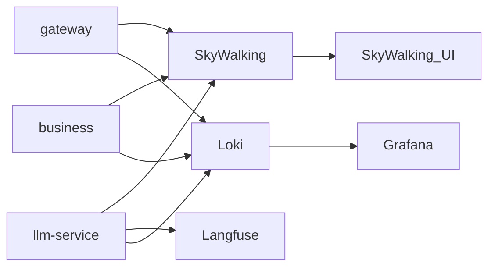

# 可观测性（Observability）

本仓库采用云原生常见组合：**Prometheus + Grafana + Loki (+ Promtail) + SkyWalking**，Agent 图细节用 **自托管 Langfuse**（免费、数据留本机）。

日常开发不必默认挂 Agent；需要时用 `make obs-up` / `make *-sw` / `make llm-obs`。

## 分层职责

| 层 | 技术 | 看什么 |
|----|------|--------|
| 跨服务链路 | SkyWalking OAP/UI | Gateway → business → llm → 工具 HTTP；Java JDBC SQL |
| Agent 图 | **Langfuse**（自托管 :3030） | LangGraph node / LLM / tool 级 trace |
| 日志 | JSON 日志 + Loki + Promtail | `request_id` / `service` / `tool_name` |
| 指标 | Micrometer + Prometheus（llm `/metrics`） | QPS、延迟、JVM |



## 快速启动

```bash
# 1) 拉起观测栈（含 Langfuse）
make obs-up
# Grafana   http://localhost:3000   admin/admin
# Loki      http://localhost:3100
# SW UI     http://localhost:8088
# Langfuse  http://localhost:3030   admin@codearena.local / admin123
# 若 Traces 为空：先确认 llm 日志有 “Langfuse tracing enabled”；再
# `docker compose -f docker-compose.langfuse.yml restart langfuse-worker`
# （worker Redis 卡住时会只入库不展示）。本机勿让 HTTP_PROXY 劫持 127.0.0.1。

# 2) 下载 Java Agent
make obs-agents

# 3) 本机带链路启动
make gateway-sw
make business-sw
make llm-obs   # SkyWalking 默认开；Langfuse 需 .env 里 LANGFUSE_TRACING=true
```

`.env` 示例（与 compose 初始化 Key 一致即可开箱）：

```bash
LANGFUSE_TRACING=true
LANGFUSE_HOST=http://127.0.0.1:3030
LANGFUSE_PUBLIC_KEY=pk-lf-codearena-local
LANGFUSE_SECRET_KEY=sk-lf-codearena-local-secret
```

## 环境变量

- `OBSERVABILITY_SKYWALKING` / `SKYWALKING_COLLECTOR`：Python Agent  
- `LANGFUSE_TRACING` / `LANGFUSE_HOST` / `LANGFUSE_PUBLIC_KEY` / `LANGFUSE_SECRET_KEY`：Agent 图  
- `CODEARENA_SQL_LOG_LEVEL=DEBUG`：Hibernate SQL 日志  

## 日志 / SQL

同前：JSON → `/tmp/codearena-*.log` → Promtail → Loki；SQL 主看 SkyWalking JDBC，辅看 Hibernate 日志。

## 与 SkyWalking 的边界

SkyWalking **不会**自动画出 LangGraph 节点；Python `tool_span` 只覆盖工具回调 business。图内推理看 **Langfuse**。
