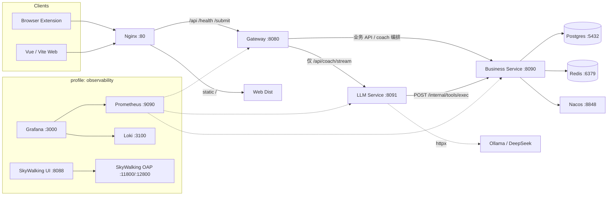

# CodeArena 架构总览

浏览器扩展 / Web 前端 → Nginx → API Gateway → 业务服务 + LLM 陪练服务，并配套 Postgres、Redis、Nacos 与可观测性组件。

**仓库形态**：Java + Python + Vue 的 **polyglot monorepo**。业务一律经 Gateway 进 **business-service**；**llm-service 仅负责陪练 SSE / LangGraph**。详见 [BUSINESS_FLOW.md](./BUSINESS_FLOW.md)、[MODULAR_BUSINESS.md](./MODULAR_BUSINESS.md)、[REPO_LAYOUT.md](./REPO_LAYOUT.md)。

## 架构图



## 端口一览

| 服务 | 端口 | 说明 |
|------|------|------|
| nginx | 80 | 静态资源 + 反向代理 |
| gateway | 8080 | API 网关 |
| business-service | 8090 | 业务服务 |
| llm-service | 8091 | Coach / LLM FastAPI |
| postgres | 5432 | 数据库 `codearena` |
| redis | 6379 | 缓存 / 会话 |
| nacos | 8848 | 配置与服务发现 |
| prometheus | 9090 | 指标（observability） |
| grafana | 3000 | 可视化（observability） |
| loki | 3100 | 日志（observability） |
| skywalking-oap | 11800 / 12800 | 链路追踪（observability） |
| skywalking-ui | 8088 | 追踪 UI（observability） |

## 本地开发 vs Docker

### 本地（推荐日常开发）

1. 基础设施：`make infra-up`（Postgres / Redis / Nacos）
2. 业务：`make business` → `:8090`（无 Postgres 时用 `local` profile 走 H2）
3. 网关：`make gateway` → `:8080`
4. LLM：`make llm` → `:8091`
5. Web：`make web-dev` → http://127.0.0.1:5173

前置：JDK 21、Maven 3.9+、Node 20+、Python 3.11+、Docker Desktop。

### Docker 全栈

```bash
cp .env.example .env
make up
# 或
./scripts/dev-up.sh full
```

可观测性：

```bash
docker compose --profile observability up -d
```

仅基础设施：

```bash
make infra-up
```

### 说明

- `llm-service` **仅** `POST /api/coach/stream`（SSE / LangGraph）；工具经 `/internal/tools/exec` 回调 Java。见 [BUSINESS_FLOW.md](./BUSINESS_FLOW.md)、[COACH_TOOLS.md](./COACH_TOOLS.md)、[COACH_MEMORY.md](./COACH_MEMORY.md)。
- Helm chart 桩位于 `deploy/helm/codearena/`。
