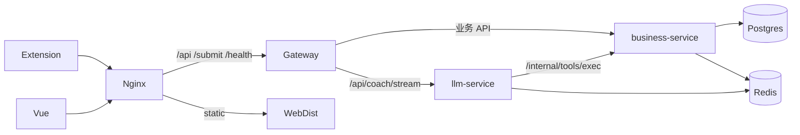

# CodeArena 架构文档

浏览器扩展 / Web → Nginx → Gateway → **business-service**（业务写库）+ **llm-service**（仅 Nex SSE）。  
数据：Postgres + Redis（Checkpoint / 可选 stats 缓存）。可观测性为 opt-in。

## 文档索引（只保留这些）

| 文档 | 用途 |
|------|------|
| [BUSINESS_FLOW.md](./BUSINESS_FLOW.md) | 服务边界与 API 归属 |
| [COACH_LANGGRAPH.md](./COACH_LANGGRAPH.md) | Nex 图、State、Checkpoint、记忆分层 |
| [COACH_TOOLS.md](./COACH_TOOLS.md) | 工具清单与内网协议 |
| [DATA_CACHE.md](./DATA_CACHE.md) | 表、索引、Redis 投影 |
| [USER_DOMAIN.md](./USER_DOMAIN.md) | 鉴权与当前用户解析 |
| [OBSERVABILITY.md](./OBSERVABILITY.md) | Prometheus / Loki / SkyWalking / Langfuse |
| [ROADMAP.md](./ROADMAP.md) | 短路线（不做的与下一步） |
| [../EXTENSION.md](../EXTENSION.md) | 浏览器扩展 |

## 端口

| 服务 | 端口 | 说明 |
|------|------|------|
| nginx / web-dev | 80 / 5173 | 入口 / Vite |
| gateway | 8080 | 唯一 API 入口 |
| business / llm | 8090 / 8091 | Docker 默认不映射宿主机；本机 `make` 直跑 |
| postgres / redis-stack | 5432 / 6380 | 库 / Checkpoint+可选缓存 |
| nacos | 8848 | 可选；发现默认关闭 |
| obs 栈 | 见 OBSERVABILITY | `make obs-up` |

## 本地开发

见仓库根 [README.md](../../README.md)：`make infra-up` → `business` / `gateway` / `llm` / `web-dev`。

**原则**：业务进 Java；对话只在 Python；客户端只连 Gateway。当前保持 **Gateway + 模块化单体 + llm 专项进程**，不要过早拆微服务。
