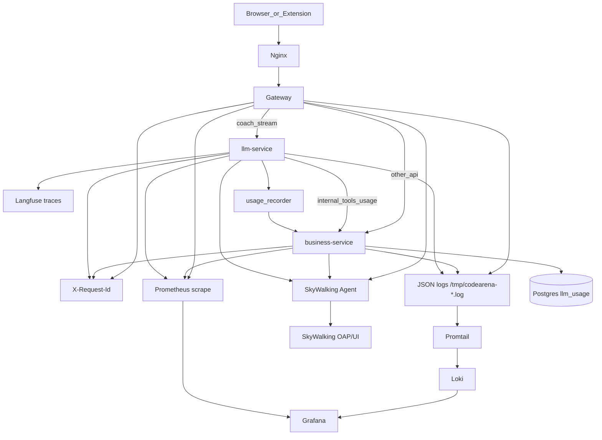

# CodeArena 项目评价与路线（整理版）

本文基于第一性原则与「不要过度开发」原则，对当前 CodeArena（仓库目录名可能仍为 LeetMate）做一次盘点：架构评价、可摘除项、功能完成度、建议新增能力、监控路径，以及高并发 / 安全 / 其他风险与对策。

**产品主轴**：浏览器扩展同步力扣提交 → 统计 / 学习计划 / 题单 → LangGraph 陪练（含本地 sandbox 解题）。

相关文档：[OVERVIEW.md](./OVERVIEW.md) · [BUSINESS_FLOW.md](./BUSINESS_FLOW.md) · [OBSERVABILITY.md](./OBSERVABILITY.md) · [COACH_LANGGRAPH.md](./COACH_LANGGRAPH.md) · [COACH_MEMORY.md](./COACH_MEMORY.md)

---

## 1. 第一性原则评价

| 原则 | 现状判定 |
|------|----------|
| 用户价值是否闭环 | **是**。扩展提交 → Dashboard 统计 → Coach 陪练/解题，主路径已贯通。 |
| 边界是否清晰 | **是**。业务写库一律 Java；Python 只做 SSE / LangGraph / 本地 sandbox；客户端只连 Gateway。 |
| 复杂度是否服务主轴 | **部分过重**。双进程陪练与三层记忆服务主轴；Nacos 默认拉起但发现关闭、team/pay 预留桩、Langfuse 全栈属于提前投入。 |
| 能否用更简单方案 | Gateway + 模块化单体 + 可选观测栈，对当前规模合理；不宜再拆 `team-service` / `payment-service` 直到有真实流量与团队边界。 |

**结论**：架构方向正确，核心能力可用。下一阶段应优先修正确性债与安全边界，而不是继续铺预留域或加新底座。

---

## 2. 过度开发判定

### 合理（保留）

- **Gateway + business-service + llm-service** 三分：鉴权集中、业务落库与推理隔离。
- **Coach 三层记忆**（Redis Checkpoint / Postgres turns / 长期记忆工具）：支撑多轮陪练。
- **可观测性 opt-in**（`make obs-up`）：Prometheus / Grafana / Loki / SkyWalking / Langfuse，日常开发可不启。
- **P0 sandbox**：本地 subprocess 执行 + 进程内配额，足以验证解题闭环。

### 过重或过早（勿再扩张）

| 项 | 说明 |
|----|------|
| Nacos | `infra-up` 默认启动，但 Gateway/Business 发现默认 `enabled: false`。保留容器即可，勿默认依赖。 |
| team / pay 桩 | 本轮已删除 Controller 与 Gateway 独立路由；表结构可留作未来迁移，**禁止再加空 API**。 |
| KG / 知识点表 | `knowledge_points` / `user_kp_mastery` 为 P1 占位；Ops KG 仍为 stub，勿在无导入链路前写业务。 |
| Gateway 预拆服务路由 | 已去掉 team/pay；`domain-users` 等可保留，但勿为不存在的服务再加空路由。 |
| Langfuse 全栈 | 7+ 容器，仅 Agent 图调试需要；与 Prometheus/Loki 分工不同，保持独立 compose。 |

---

## 3. 可摘除汇总

### 本轮已摘除

| 项 | 动作 |
|----|------|
| `team` 域桩 | 删除 `TeamController` / `package-info` |
| `pay` 域桩 | 删除 `PayController` / `package-info` |
| Gateway `domain-team` / `domain-pay` | 从 `application.yml` 与 `application-nacos.yml` 移除 |
| `mock_token_stream` | 从 `apps/llm-service/app/services/sse.py` 移除（仅保留 `sse_pack`） |

### 建议保留但勿扩张

| 项 | 理由 |
|----|------|
| Nacos 容器 / `nacos` profile | 可选服务发现；关掉 discovery 即可，删容器收益小 |
| KG Ops stub、KP 占位表 | 删迁移成本高；产品未做前保持 stub |
| Helm 骨架 | 未来发布占位，无运行时成本 |
| `.agents/skills/` | Cursor 开发辅助，非产品运行时 |
| Langfuse / Prom / Loki / SW | 已是 `obs-up` 可选栈 |

### 仅文档标注（未删代码）

- Business 侧 `RedisConfig` 已接线但业务缓存几乎未用（local profile 甚至排除自动配置）——勿为「用上 Redis」而硬加缓存。
- Ops 部分接口（rebuild stats、KG import）仍返回 stub message。
- `HealthController` 中部分字段为前端兼容硬编码，非真实探测。

---

## 4. 功能完成度

| 能力 | 状态 | 说明 |
|------|------|------|
| 鉴权 / JWT / 扩展同步 | **DONE** | Gateway JWT；扩展提交 `/submit` |
| Dashboard 统计核心 | **DONE** | 今日/近 7 日/连续打卡/错题；难度分布字段仍为占位 0 |
| 学习偏好 / 题单 CRUD | **PARTIAL** | API+UI 有；题单进度恒 0；前后端字段 `list_done` vs `done` 不一致；偏好查询未严格按 `user_id` |
| 掌握标记 | **DONE** | `/api/mastered` |
| 刷题计划 / 今日任务 | **PARTIAL** | 计划生成与 `/api/review/today` 有；非 SRS |
| Coach 会话 / LangGraph | **DONE** | hydrate→agent⇄tools→persist；SSE |
| Coach 三层记忆 | **DONE** | L1/L2/L3；小缺口见 openspec（如 `append_code_run`） |
| Sandbox 解题 | **DONE（P0）** | subprocess + 配额；无强隔离 |
| 用户资料 API | **PARTIAL** | PATCH 有；无独立资料设置页；Coach `get_user_profile_summary` 可用 |
| 用户整体画像 | **PARTIAL** | = 提交统计 + 掌握数 + L3 记忆摘要；无独立 persona 模型/UI |
| PDF / 文档学习 | **MISSING** | 明确非目标（暂不做向量 RAG / Book） |
| 知识点 / KG | **MISSING** | 表占位 + Ops stub |
| 组队 / 支付 | **REMOVED（桩）** | 本轮摘除空 API |

---

## 5. 建议新增能力（按优先级，本文不实现）

### P0 — 正确性债（应先于新功能）

1. **题单进度真实计算**，并统一前后端字段（`done`/`total` 或 `list_done`/`list_total`）。
2. **学习偏好按用户隔离**（按 `user_id` 读写，禁止 `findFirstByOrderByIdAsc`）。
3. **难度分布** `easy/medium/hard_solved` 按提交真实聚合。
4. **`GetTopicMasteryTool` 按用户过滤**（避免全局 `problem_stats`）。
5. **安全基线**：生产不映射 8090/8091；business 无 Bearer 时不信任客户端 `X-User-Public-Id`；强密钥；Gateway 限流。

### P1 — 学习闭环增强

1. **最小 SRS**：基于掌握标记 + 错题 + 间隔，产出真正「今日复习」队列（可与 `study_plans` 并存）。
2. **用户资料 / Settings 页**：编辑 display_name、时区、locale；展示 LLM 用量。
3. **薄弱点计划** `goal_type=weak`（见 [COACH_PLAN_AGENT.md](./COACH_PLAN_AGENT.md)）。
4. **沙箱加固**：bwrap / sidecar、内存与网络隔离；配额进 Redis（多副本一致）。
5. **`append_code_run` 审计**与 openspec 集成验收收尾。

### P2 — 扩展体验（明确延后）

1. **PDF / 讲义上传 → 结构化笔记或轻量检索**（向量 RAG 仍建议在结构化记忆稳定后再议）。
2. **知识图谱导入与 `kg_mode` 实逻辑**。
3. OAuth（GitHub/微信）、邮箱验证、RBAC。
4. 组队刷题 / 支付会员（有真实需求再重建域，勿先加空 Controller）。

---

## 6. 监控路径汇总

| 信号 | 路径 | 入口 |
|------|------|------|
| 请求关联 | `X-Request-Id` 贯穿 Gateway → Business/LLM → 内网回调 | `RequestIdGlobalFilter` / `RequestIdFilter` / `request_context.py` |
| 指标 | Micrometer `/actuator/prometheus`；LLM `/metrics` | `make obs-up` → Prometheus :9090 → Grafana :3000 |
| 日志 | JSON → Promtail → Loki | `logback-spring.xml` / `logging_setup.py` |
| 跨服务链路 | SkyWalking Java/Python Agent → OAP | `scripts/with-sw-agent.sh`、`skywalking_agent.py`；UI :8088 |
| Agent 图 | Langfuse（自托管 compose） | `langfuse_setup.py`；:3030 |
| Token 用量 | LLM → `POST /internal/llm/usage` → Postgres | `usage_recorder.py` / `LlmUsageService` |

细节与启动命令见 [OBSERVABILITY.md](./OBSERVABILITY.md)。

---

## 7. 风险与对策

### 7.1 安全

| 风险 | 严重度 | 对策 |
|------|--------|------|
| 直连 `:8091` 伪造 `X-User-Public-Id` 消耗 LLM | 高 | 生产不对外映射 llm/business；K8s NetworkPolicy；llm 校验 Gateway 签名或 mTLS |
| 直连 `:8090` 信任伪造用户头 / 猜 Internal Token | 高 | `CurrentUserService`：无有效 Bearer 时拒绝信任客户端用户头；Internal Token 强制非空且轮换 |
| 默认 JWT / Internal Token | 高 | 生产强制强随机密钥；启动时检测默认值则 fail-fast |
| 沙箱仅 subprocess | 高 | bwrap/gVisor/sidecar；禁网；cgroup 限 CPU/内存；审计 `coach_code_runs` |
| 无 Gateway API 限流 | 中 | Resilience4j RateLimiter 或 Redis 令牌桶；对 `/api/coach/stream`、`/submit` 单独配额 |
| `/actuator/**` 公开 | 中 | 仅内网或加鉴权；生产收窄 exposure |
| LLM CORS 回显任意 Origin | 低 | 生产白名单 |

### 7.2 高并发

| 瓶颈 | 对策 |
|------|------|
| Hikari `maximum-pool-size: 10` | 按副本与 DB 上限调池；避免长事务 |
| SSE 每连接一线程跑同步 LangGraph | 异步化图执行或有界线程池；限制并发会话数 |
| 阻塞 `subprocess.run` + 进程内配额 | 独立 worker 池；配额存 Redis，多副本共享 |
| Gateway TimeLimiter 默认 15s vs 长 SSE | coach stream 路由禁用/加长 TimeLimiter，或绕过该 filter |
| Redis Checkpoint 单点 | Redis 高可用；失败回退 MemorySaver 仅开发可用 |
| 上游 LLM 无全局队列 | 按用户/全局令牌桶；排队与超时策略 |

### 7.3 其他（正确性 / 运维）

| 问题 | 对策 |
|------|------|
| 学习偏好未按用户隔离 | P0 修复查询与写入维度 |
| 题单进度恒 0、字段名不一致 | P0 对齐 API 契约与前端 store |
| `GetTopicMasteryTool` 非用户维度 | 按 `user_id` 聚合提交/掌握 |
| 文档与实现不一致（USER_DOMAIN 鉴权描述） | 改代码或改文档，二选一保持一致 |
| `request_id` 与 SkyWalking `trace_id` 弱关联 | 日志字段同时打出；Grafana 面板支持双查 |
| openspec 集成验收未勾选 | 合并前补 7.x 手工/自动化验收清单 |

---

## 8. 本轮变更摘要

1. 新增本文作为架构评价与路线单一入口。
2. 摘除 team/pay 空桩与未使用 `mock_token_stream`，收窄 Gateway 预留路由。
3. 不实现 PDF / SRS / 新画像 UI；上述列入 P0–P2 路线。
