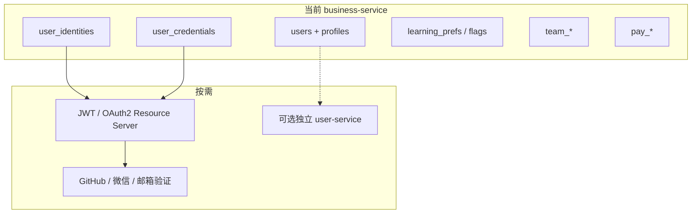

# 用户域设计：与旧 SQL 结合 & 扩展方向

## 与旧 schema 的关系

V1 已有核心表 `users(id, username, display_name, created_at)`，且被：

- `learning_prefs.user_id`
- `team_rooms.owner_user_id` / `team_members.user_id`
- `pay_orders.user_id`

**策略：不重建 `users`，只做扩展**（V3），避免打断 FK。

| 对象 | 做法 |
|------|------|
| `users` | 增加 `public_id`（对外 ID）、`email`、`status`、`updated_at` |
| `user_profiles` | 新建：头像/简介/locale/timezone（避免 users 表膨胀） |
| `user_identities` | 新建：`local` / 未来 `github` / `wechat` 等登录身份 |
| `user_credentials` | 新建：密码哈希预留（鉴权未接时可空） |
| `user_problem_flags` | 原仅 `problem_id` PK → `(user_id, problem_id)`，旧行归到 `default` |
| `submissions` | 增加可空 `user_id`，历史行回填 `default`，新提交写入当前用户 |

种子用户 `default`（V1）保留：无登录头时作为隐式当前用户，兼容旧单用户行为。

## 包结构

```
com.codearena.business.user
  api/        UserLookup（跨域门面；规划抽成 user-api Maven 模块）
  domain/     UserEntity, Profile, Identity, Credential, LlmSettings + repositories
  service/    UserService implements UserLookup, CurrentUserService, UserLlmSettingsService
  web/
    external/ UserController, UserLlmController   (/api/users/**)
    internal/ InternalUserLlmController           (/internal/users/**)
```

对外只暴露 `public_id`（如 `usr_…`），内部 FK 仍用 `users.id` BIGINT。
跨域请依赖 `UserLookup`，不要直接注入 `UserService`。

## 当前用户如何解析

`CurrentUserService`（业务侧）：

1. `Authorization: Bearer <JWT>` → 验签 + `auth_sessions`（按 `jti`）未吊销  
2. 开发兼容：`X-User-Public-Id`  
3. 否则 → `ensureDefaultUser()`

**Gateway**（`JwtAuthGlobalFilter`）对非公开路径强制校验 JWT，并注入可信头 `X-User-Public-Id` / `X-User-Id`。  
公开路径：`/health`、`/api/auth/login|register|device`。

接入更多 OAuth 时仍只改本类 + `user_identities`。Learning / Submit / Stats 已依赖它。

## 鉴权 API（经 Gateway `/api/auth/**`）

| Method | Path | 说明 |
|--------|------|------|
| POST | `/api/auth/device` | 扩展设备静默登录 `{device_id}`（公开） |
| POST | `/api/auth/register` | 注册（公开），返回 JWT |
| POST | `/api/auth/login` | 登录（公开），返回 JWT |
| POST | `/api/auth/logout` | 吊销当前 JWT 的 jti |
| GET | `/api/auth/me` | 当前用户（需 JWT） |

JWT 密钥：`CODEARENA_JWT_SECRET`（Gateway 与 business 共用）。扩展说明见 [EXTENSION.md](../EXTENSION.md)。
## API（经 Gateway `/api/users/**`）

| Method | Path | 说明 |
|--------|------|------|
| GET | `/api/users/health` | 域探活 |
| GET | `/api/users/me` | 当前用户 |
| PATCH | `/api/users/me` | 改资料 / profile |
| GET | `/api/users/{publicId}` | 按对外 ID 查询 |
| POST | `/api/users` | 注册 `{username, display_name?, email?}` |
| GET | `/api/users?page=&size=` | 列表（后续加权限） |

## 未来扩展方向（不必现在拆服务）



1. **鉴权**：Spring Security + JWT；`user_credentials.password_hash` 用 BCrypt；`user_identities` 挂 OAuth。  
2. **邮箱验证 / 2FA**：新表 `user_verification_tokens`，勿塞进 `users`。  
3. **RBAC**：`user_roles` / `roles`，与支付/组队权限分离。  
4. **拆 `user-service`**：仅当账号域独立发版或合规要求时；Gateway `domain-users` 改 URI，搬 `user` 包 + 用户相关表。  
5. **学习数据按用户**：`learning_prefs` 已有 `user_id`，后续读写改为 `CurrentUserService`（与 mastered 一致）。

## 本地验证

```bash
# 需 Postgres + Flyway（非 local H2 profile）
curl -s http://127.0.0.1:8090/api/users/me
curl -s -X POST http://127.0.0.1:8090/api/users \
  -H 'Content-Type: application/json' \
  -d '{"username":"alice","display_name":"Alice"}'
curl -s http://127.0.0.1:8090/api/users/me -H 'X-User-Public-Id: usr_...'
```
